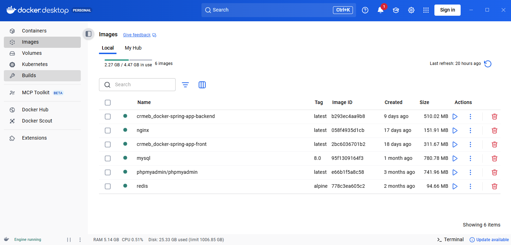
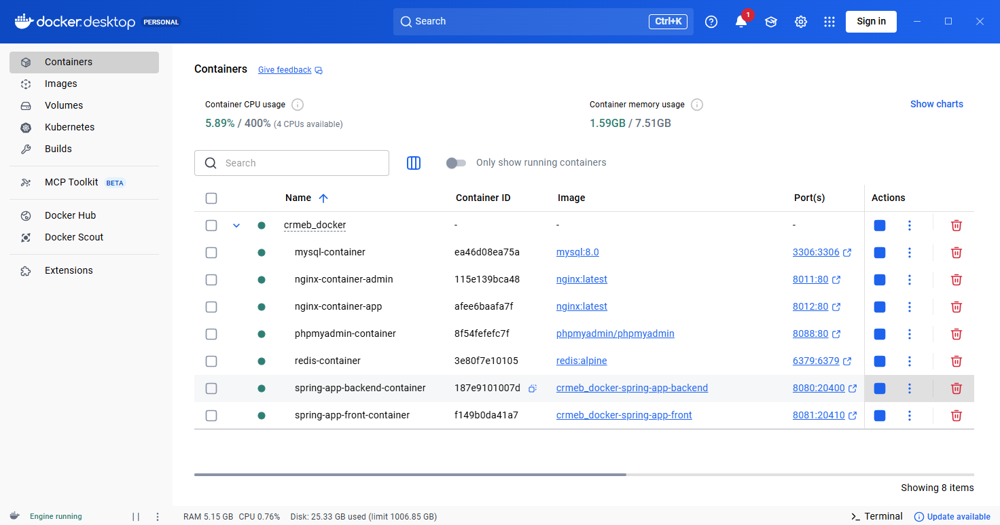

# docker-compose 快速运行项目
## 1、安装docker
docker 官网下载
https://desktop.docker.com/win/main/amd64/Docker%20Desktop%20Installer.exe?utm_source=docker&utm_medium=webreferral&utm_campaign=docs-driven-download-win-amd64

## 2、安装docker-compose
https://github.com/docker/compose/releases/download/v5.0.0/docker-compose-windows-x86_64.exe


## 3、启动项目
```
进入docker-compose目录 cd /docker-compose

运行命令：docker-compose up -d

```

## 4、运行画面

<br>


## 5、常见问题
1. 端口被占用，进入docker-compose.yml 里面修改端口

2. 如果运行docker-compose up -d 启动失败，请查看docker-compose.yml 修改里面镜像地址或其它配置


